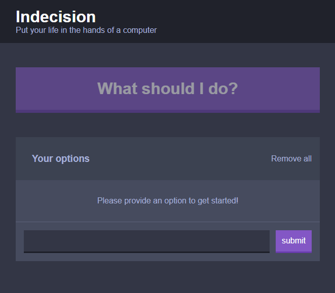

# Indecision_app

## Put your life in the hands of a computer

This simple web app was built with React and Scss.
It allows the user to add items to a list, and then click a button to randomly get one of the items back, displayed on a modal.

This project uses some stateful Class-components to handle state management, and  some stateless functional components to handle the static UI of the page.

Redux is *not* included in this project

The code and design was adapted from the Udemy course "The Complete React Developer Course (w/ Hooks and Redux)" by Andrew Mead.

Link: <https://www.udemy.com/course/react-2nd-edition/>

Image of the application:

### Usage instruction

- Requirements: Node ++12.0.0 package manager
  - Link: <https://nodejs.org/>

the project is currently set to compile in development mode, and you can change it to production mode in the webpack.config.js file

1. Download the project, either as a zip or by cloning it to your git client of choice.

2. Open a console in the project folder and run the command `npm install` to get the projects dependencies.

3. run the command `npm run dev-server` to launch the webpack dev-server, or run the command `npm run build` to build the project.
